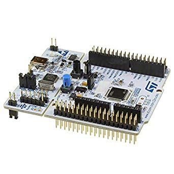

# Serial Console with Temperature Detection

This is the final project from the course Embedded System 1. This project was a room temperature detection system in Assembly with 3 modes for collecting data: buffer mode, slow mode, and fast mode.

## Micro-Controller and Board Schema

### Micro-Controller

The micro-controller of the embedded system is STM32F446RE, and the processor is ARM® Cortex®-M4 32-bit RISC core operating at a frequency of up to 180 MHz.

### Board Schema

Peripherals consists of:

* Keypad
* Buzzer
* IR Signal Receiver
* Analog-to-Digital Converter (ADC)
* LED lights
* LCD screen
* Temperature Detector.

## Build Instruction

System Workbench for STM32 is the great tool for building and deploy applications to STM32 micro-controllers. It can be downloaded from the [link](https://www.openstm32.org/Downloading+the+System+Workbench+for+STM32+installer?structure=Documentation). You can create the F446RE project, and copy code from the repo to the project and build it.

## How to use the system?

The Embedded System uses USART to interact with the console, so make sure the board is connected with your PC and use PuTTY or other terminal simulators to interract with the system.

In the final product, temperature samples are collected every 1s under fast mode or 10s under slow mode. All data will be printed when the buffer mode is toggled. Pressing ’h’ will show the system instruction.

## Demo

